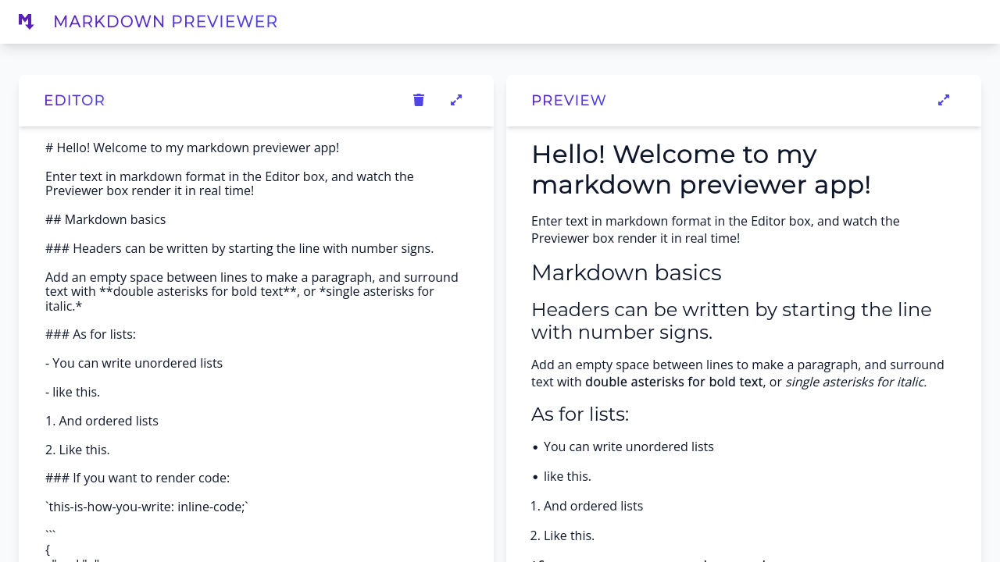

# Markdown Previewer App

A lightweight, intuitive Markdown previewer web app.

  
Table of Contents

  <ol>
    <li><a href="#description">Description</a></li>
    <li><a href="#live-demo">Live Demo</a></li>
    <li><a href="#built-with">Built With</a></li>
    <li><a href="#author">Author</a></li>
    <li><a href="#license">License</a></li>
  </ol>

## Description

This is a lightweight, easy-to-use Markdown previewer web app. Users can enter Markdown into the editor box, and watch it render in the preview box in real time.

 

## Live Demo

Preview the live demo: [https://jonrutter-markdown-previewer.netlify.app/](https://jonrutter-markdown-previewer.netlify.app/)

## Built with

- [React](https://reactjs.org/)
- CSS Modules

## Author

**Jon Rutter**

- [GitHub Profile](https://www.github.com/jonrutter)
- [Email](mailto:contact@jonrutter.io)
- [Website](https://www.jonrutter.io)

## License

This project is licensed under the MIT License. See the LICENSE file for details.
